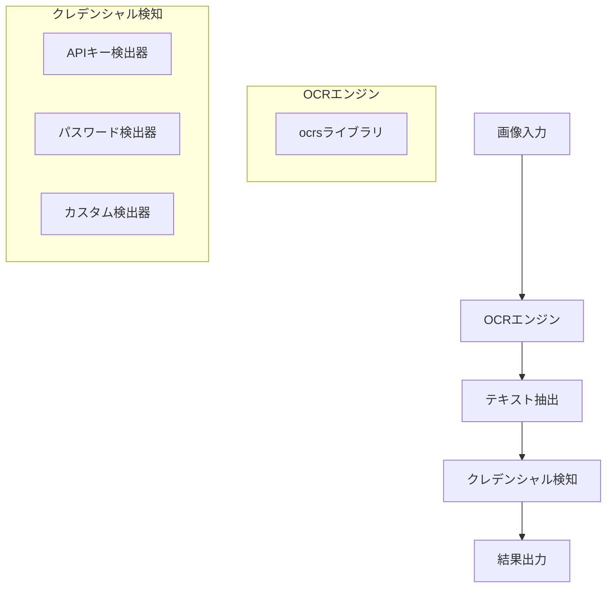

> **注意**:
> - このドキュメントはLLM Agentによって出力されています
> - 現在の実装にそぐっていない可能性があります

# OCRクレデンシャル検出ライブラリの設計

## 1. 全体アーキテクチャ

ライブラリの全体的なアーキテクチャは以下のようになります：



## 2. 主要コンポーネント

### 2.1 CredentialDetector構造体

```rust
pub struct CredentialDetector {
    ocr_engine: OcrEngine,
    detectors: Vec<Box<dyn CredentialDetectorLogic>>,
}

impl CredentialDetector {
    pub fn new() -> Result<Self, CredentialDetectorError> {
        // OcrEngineの初期化
        // デフォルトの検出器を登録
    }
    
    pub fn with_detector(mut self, detector: Box<dyn CredentialDetectorLogic>) -> Self {
        // カスタム検出器を追加
    }
    
    pub fn detect_from_image(&self, image: &[u8]) -> Result<Vec<CredentialDetection>, CredentialDetectorError> {
        // 1. 画像をOCRエンジンに渡す
        // 2. テキストを抽出
        // 3. 各検出器でクレデンシャルを検出
        // 4. 結果を返す
    }
    
    pub fn detect_from_path(&self, path: &str) -> Result<Vec<CredentialDetection>, CredentialDetectorError> {
        // ファイルから画像を読み込み、detect_from_imageを呼び出す
    }
}
```

### 2.2 CredentialDetectorLogic トレイト

```rust
pub trait CredentialDetectorLogic {
    fn name(&self) -> &str;
    fn detect(&self, text_lines: &[TextLine]) -> Vec<CredentialDetection>;
}
```

### 2.3 検出結果の構造体

```rust
pub struct CredentialDetection {
    pub text: String,
    pub bounding_box: BoundingBox,
    pub text_detection_score: f32,
    pub credential_score: f32,
    pub detector_name: String,
}

pub struct BoundingBox {
    pub x: f32,
    pub y: f32,
    pub width: f32,
    pub height: f32,
}
```

### 2.4 エラー処理

```rust
#[derive(thiserror::Error, Debug)]
pub enum CredentialDetectorError {
    #[error("OCRエンジンの初期化に失敗しました: {0}")]
    OcrEngineInitError(String),
    
    #[error("画像の読み込みに失敗しました: {0}")]
    ImageLoadError(String),
    
    #[error("OCR処理に失敗しました: {0}")]
    OcrProcessError(String),
    
    #[error("ファイルが見つかりません: {0}")]
    FileNotFoundError(String),
    
    #[error("不明なエラー: {0}")]
    UnknownError(String),
}
```

## 3. デフォルト検出器の実装

### 3.1 APIキー検出器

```rust
pub struct ApiKeyDetector {
    patterns: Vec<Regex>,
}

impl CredentialDetectorLogic for ApiKeyDetector {
    fn name(&self) -> &str {
        "APIキー検出器"
    }
    
    fn detect(&self, text_lines: &[TextLine]) -> Vec<CredentialDetection> {
        // APIキーのパターンに一致するテキストを検出
        // 例: 長い英数字の文字列、特定のプレフィックスを持つ文字列など
    }
}
```

### 3.2 パスワード検出器

```rust
pub struct PasswordDetector {
    keywords: Vec<&'static str>,
}

impl CredentialDetectorLogic for PasswordDetector {
    fn name(&self) -> &str {
        "パスワード検出器"
    }
    
    fn detect(&self, text_lines: &[TextLine]) -> Vec<CredentialDetection> {
        // パスワードに関連するキーワード（"password", "pwd"など）の近くにある
        // 英数字や特殊文字を含む文字列を検出
    }
}
```

## 4. プロジェクト構造

```
.
├── Cargo.toml
├── src/
│   ├── lib.rs                  # ライブラリのエントリーポイント
│   ├── detector.rs             # CredentialDetector構造体の実装
│   ├── error.rs                # エラー型の定義
│   ├── types.rs                # 共通の型定義（BoundingBoxなど）
│   ├── detectors/              # 各種検出器の実装
│   │   ├── mod.rs              # モジュール定義
│   │   ├── api_key.rs          # APIキー検出器
│   │   └── password.rs         # パスワード検出器
│   └── ocr/                    # OCR関連の実装
│       ├── mod.rs              # モジュール定義
│       └── engine.rs           # ocrsライブラリのラッパー
└── examples/                   # 使用例
    ├── basic_detection.rs      # 基本的な検出例
    ├── custom_detector.rs      # カスタム検出器の使用例
    └── batch_processing.rs     # 複数画像の一括処理例
```

## 5. 使用例（examples/basic_detection.rs）

```rust
use ocr_credential_detector::{CredentialDetector, CredentialDetectorError};
use std::path::Path;

fn main() -> Result<(), Box<dyn std::error::Error>> {
    // CredentialDetectorの初期化
    let detector = CredentialDetector::new()?;
    
    // 画像からクレデンシャルを検出
    let image_path = Path::new("examples/images/screenshot.png");
    let detections = detector.detect_from_path(image_path.to_str().unwrap())?;
    
    // 検出結果を表示
    for detection in detections {
        println!("検出されたクレデンシャル: {}", detection.text);
        println!("位置: ({}, {}) - {}x{}", 
            detection.bounding_box.x, 
            detection.bounding_box.y,
            detection.bounding_box.width,
            detection.bounding_box.height
        );
        println!("テキスト検出スコア: {}", detection.text_detection_score);
        println!("クレデンシャルスコア: {}", detection.credential_score);
        println!("検出器: {}", detection.detector_name);
        println!("---");
    }
    
    Ok(())
}
```

## 6. カスタム検出器の例（examples/custom_detector.rs）

```rust
use ocr_credential_detector::{
    CredentialDetector, 
    CredentialDetectorLogic, 
    CredentialDetection,
    BoundingBox,
    TextLine
};
use std::path::Path;

// カスタム検出器の実装
struct CreditCardDetector;

impl CreditCardDetector {
    fn new() -> Self {
        CreditCardDetector
    }
}

impl CredentialDetectorLogic for CreditCardDetector {
    fn name(&self) -> &str {
        "クレジットカード番号検出器"
    }
    
    fn detect(&self, text_lines: &[TextLine]) -> Vec<CredentialDetection> {
        // クレジットカード番号のパターン（16桁の数字、4桁ごとにスペースやハイフンで区切られている可能性あり）
        // 実装例...
        vec![] // 実際の実装では検出結果を返す
    }
}

fn main() -> Result<(), Box<dyn std::error::Error>> {
    // 基本的な検出器で初期化
    let mut detector = CredentialDetector::new()?;
    
    // カスタム検出器を追加
    let custom_detector = Box::new(CreditCardDetector::new());
    let detector = detector.with_detector(custom_detector);
    
    // 画像からクレデンシャルを検出
    let image_path = Path::new("examples/images/receipt.png");
    let detections = detector.detect_from_path(image_path.to_str().unwrap())?;
    
    // 検出結果を表示
    println!("検出されたクレデンシャル数: {}", detections.len());
    for detection in detections {
        println!("検出されたクレデンシャル: {}", detection.text);
        println!("検出器: {}", detection.detector_name);
        println!("---");
    }
    
    Ok(())
}
```

## 7. 依存クレート（Cargo.toml）

```toml
[package]
name = "ocr-credential-detector"
version = "0.1.0"
edition = "2024"
description = "画像内のクレデンシャル（APIキー、パスワードなど）を検出するライブラリ"
license = "MIT"
repository = "https://github.com/username/ocr-credential-detector"

[dependencies]
ocrs = "0.10.0"             # OCRエンジン
thiserror = "1.0"           # エラー処理
regex = "1.5"               # 正規表現
image = "0.24"              # 画像処理

[[example]]
name = "basic_detection"
path = "examples/basic_detection.rs"

[[example]]
name = "custom_detector"
path = "examples/custom_detector.rs"

[[example]]
name = "batch_processing"
path = "examples/batch_processing.rs"
```

## 8. 拡張性と将来の展望

1. **新しい検出器の追加**：`CredentialDetectorLogic`トレイトを実装することで、新しい種類のクレデンシャル検出器を簡単に追加できます。

2. **検出アルゴリズムの改善**：機械学習ベースの検出器を追加することで、より高度なクレデンシャル検知が可能になります。

3. **パフォーマンス最適化**：大量の画像を処理する場合、並列処理を導入することでパフォーマンスを向上させることができます。

4. **国際化対応**：多言語のクレデンシャル検知をサポートするために、言語固有の検出器を追加できます。

5. **CLIツールの提供**：ライブラリの機能をコマンドラインから利用できるCLIツールを提供することで、より幅広いユースケースに対応できます。